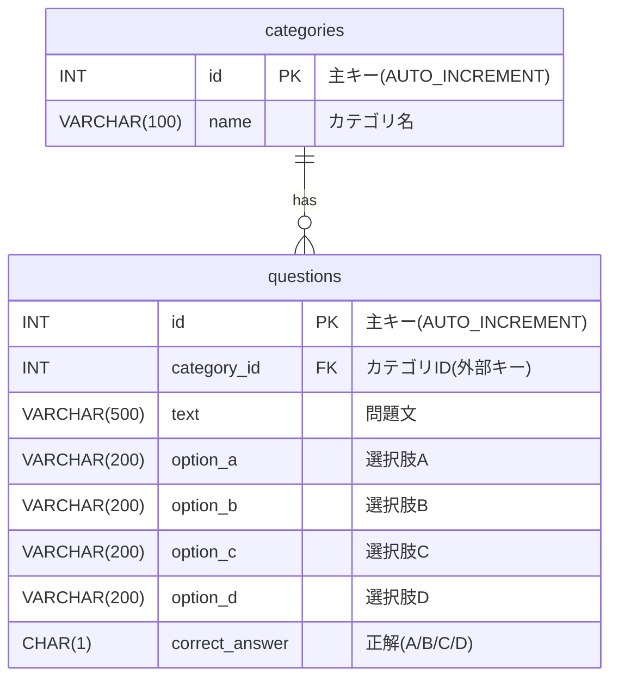

# E-R図: QuizSpringAppli

## テーブル構成



## リレーションシップ

- **categories 1 : N questions**
  - 1つのカテゴリは複数の問題を持つ
  - 1つの問題は必ず1つのカテゴリに属する
  - 外部キー: `questions.category_id` → `categories.id`

## データ例

### categories テーブル
| id | name |
|----|------|
| 1 | Java基礎 |
| 2 | Spring Boot |
| 3 | データベース |
| 4 | ネットワーク |

### questions テーブル
| id | category_id | text | option_a | option_b | option_c | option_d | correct_answer |
|----|-------------|------|----------|----------|----------|----------|----------------|
| 1 | 1 | Javaのprintlnはどのクラスにある? | System.in | System.out | System.err | System.log | B |
| 2 | 1 | Javaのint型は何ビット? | 8 | 16 | 32 | 64 | C |
| 3 | 1 | JavaでNullPointerExceptionが発生する原因は? | メモリ不足 | null参照 | 型変換エラー | 無限ループ | B |
| 4 | 2 | Spring Bootのデフォルトポートは? | 3000 | 8080 | 5000 | 9000 | B |
| 5 | 2 | MyBatisで使用するアノテーションは? | @Service | @Mapper | @Controller | @Component | B |
| 6 | 2 | @Controllerの役割は? | データアクセス | ビジネスロジック | リクエスト処理 | 設定管理 | C |
| 7 | 3 | SQLでデータを取得するのは? | INSERT | UPDATE | SELECT | DELETE | C |
| 8 | 3 | 主キーの制約は? | 重複可 | 重複不可 | NULL可 | なんでも可 | B |
| 9 | 4 | HTTPSのポート番号は? | 80 | 443 | 8080 | 3000 | B |
| 10 | 4 | IPアドレスのバージョンは? | v1とv2 | v4とv6 | v3とv5 | v2とv4 | B |

## SQL JOINクエリ例

### カテゴリ別問題数を取得（LEFT JOIN + GROUP BY）
```sql
SELECT 
    c.id,
    c.name,
    COUNT(q.id) AS questionCount
FROM categories c
LEFT JOIN questions q ON c.id = q.category_id
GROUP BY c.id, c.name
ORDER BY c.id;
```

### カテゴリ名付きで問題一覧を取得（INNER JOIN）
```sql
SELECT 
    q.id,
    q.text,
    q.correct_answer,
    c.name AS categoryName
FROM questions q
INNER JOIN categories c ON q.category_id = c.id
ORDER BY q.id;
```

### 特定カテゴリの問題を取得（WHERE句のみ、JOINなし）
```sql
SELECT * 
FROM questions 
WHERE category_id = 1 
ORDER BY id;
```

## 推奨DDL（外部キー付き）

カテゴリ別出題とJOINを活用するため、`questions` に `category_id` を追加した構成を推奨します。

```sql
-- categories
CREATE TABLE categories (
    id INT AUTO_INCREMENT PRIMARY KEY,
    name VARCHAR(100) NOT NULL
);

-- questions（外部キー付き）
CREATE TABLE questions (
    id INT AUTO_INCREMENT PRIMARY KEY,
    category_id INT NOT NULL,
    text VARCHAR(500) NOT NULL,
    option_a VARCHAR(200) NOT NULL,
    option_b VARCHAR(200) NOT NULL,
    option_c VARCHAR(200) NOT NULL,
    option_d VARCHAR(200) NOT NULL,
    correct_answer CHAR(1) NOT NULL,
    FOREIGN KEY (category_id) REFERENCES categories(id)
);
```

## 制約

- **主キー制約**: 各テーブルの`id`フィールド
- **外部キー制約**: `questions.category_id` → `categories.id`
- **NOT NULL制約**: 全てのフィールド（主キーを除く）
- **AUTO_INCREMENT**: 主キー`id`は自動採番
